# All MySQL commands in one place.
It contains all the necessary commands to get started with mysql using shell to interact with the mysql database.

<br>
<br>

# User commands:

### Login
```bash
mysql -u root -p # root is the username here
```

### Show Users
```sql
SELECT User, Host FROM mysql.user;
```

### Create User
```sql
CREATE USER 'demouser'@'localhost' IDENTIFIED BY 'demopassword';
```

### Grant Privileges on all Databases
```sql
GRANT ALL PRIVILEGES ON * . * TO 'demouser'@'localhost';
FLUSH PRIVILEGES;
```

### Show Grants
```sql
SHOW GRANTS FOR 'demouser'@'localhost';
```

### Remove Grants
```sql
REVOKE ALL PRIVILEGES, GRANT OPTION FROM 'demouser'@'localhost';
```

### Delete User:
```sql
DROP USER 'demouser'@'localhost';
```

### Exit
```sql
exit;
```

<br>
<br>

# Databse Commands:

### Show Databases
```sql
SHOW DATABASES;
```

### Create Database
```sql
CREATE DATABASE mydb;
```

### Delete Database
```sql
DROP DATABASE mydb;
```

### Select Database
```sql
USE mydb;
```

<br>
<br>

# Table Commands:

### Create Table
```sql
CREATE TABLE user(
  id INT AUTO_INCREMENT,
  first_name VARCHAR(100),
  last_name VARCHAR(100),
  email VARCHAR(50),
  password VARCHAR(20),
  is_admin TINYINT(1),
  register_date DATETIME,
  PRIMARY KEY(id)
);
```

### Show Tables
```sql
SHOW TABLES;
```

### Rename a table
```sql
RENAME TABLE employees TO workers;
```

### Delete Table
```sql
DROP TABLE user
```

<br>
<br>

# Column Commands

### Add new column (`ALTER` keyword)
```sql
ALTER TABLE users ADD age INT;
```

### Rename Column Name (`ALTER` keyword)
```sql
ALTER TABLE users
RENAME COLUMN is_admin TO role;
```

### `MODIFY` column (Data Type)
```sql
ALTER TABLE users
MODIFY COLUMN email VARCHAR(100);
```

### Move Columns/ Change order (`AFTER` keyword)
```sql
MODIFY email VARCHAR(100)
AFTER password;

-- TO move it to first
MODIFY email VARCHAR(100)
FIRST;
```

### Delete a column
```sql
ALTER TABLE users
DROP COLUMN last_name;
```
<br>
<br>

# Data Manipulation

### Insert Row / Record
```sql
INSERT INTO users (first_name, last_name, email, password, is_admin, register_date) values
('Steve', 'Rogers', 'steverog@gmail.com', '123456', 1, now()),
('Natasha', 'Romanoff', 1, now()),
('Tony', 'Stark', 'tonystark@gmail.com', '123456', 0, now());
```

### Insert into some columns:
```sql
INSERT INTO users (first_name, last_name, is_admin, register_date) values
('Natasha', 'Romanoff', 1, now());
-- These empty fields will be null
```

### Show All data
```sql
SELECT * FROM users;
```

### Show particular column
```sql
SELECT first_name, email FROM users;
```

### `WHERE`  Clause
```sql
SELECT * FROM users WHERE is_admin = 1;
SELECT * FROM users WHERE first_name = 'Steve';
SELECT * from users WHERE last_name = 'Stark' AND is_admin = 0;
SELECT * FROM user WHERE id != 1;
```

### `IS NULL` Keyword
```sql
SELECT * 
FROM users
WHERE email IS NULL;

-- Also can be used with NOT
SELECT * 
FROM users
WHERE email IS NOT NULL;
```

### `DELETE` Row
```sql
DELETE FROM users WHERE id = 2;

-- Removing WHERE will delete all rows
-- e.g
DELETE FROM uesrs;
```

### `UPDATE` Row
```sql
UPDATE users SET email = 'natasha@gmail.com' WHERE id = 3;
```

### Update multiple columns at once
```sql
UPDATE users
SET email = 'nat@gmail.com'
    password = 'nat1234'
WHERE id = 3;
```

### Set some fields equal to `NULL`
```sql
UPDATE users;
SET password = NULL
WHERE is_admin = 0;
```

### Set field of all rows.
```sql
UPDATE users
SET is_admin = 0; 
-- By just removing the where clause.
-- sets the value of all users' is_admin field = 0
```

<br>
<br>


# AUTOCOMMIT, COMMIT, ROLLBACK:

> What If you accidently delete all the rows by forgetting to put where clause. To avoid that shit, just put `AUTOCOMMIT=OFF` then after each __Transaction__ _(sequence of one or more SQL operations that are executed as a single logical unit of work)_ write `COMMIT` manually. Now If you forget to put where caluse and accidently delete all rows you can simply get all data back by writing `ROLLBACK`.

### Turn off autocommit:
```sql
SET AUTOCOMMIT = OFF;
```

### After each transaction `COMMIT`:
```sql
-- Let's say you entered some data at this point:
INSERT INTO users (first_name, last_name, email, password, is_admin, register_date) values
('Bruce', 'Banner', 'bruce.banner@gmail.com', '123456', 0, NOW()),
('Clint', 'Barton', 'clint.barton@gmail.com', '123456', 0, NOW());

-- Now Writing COMMIT creates a checkpoint here.
COMMIT;
-- assume it's -> CHECKPOINT 1.
-- Your progress is saved upto here.
```

### How to rollback:

1. Lets say STUPID you deleted all rows accidently🤦.

    ```sql
    DELETE FROM users;
    ```

2. Simply Write `ROLLBACK`. It will again set your progress upto the last checkpoint or last `COMMIT` you made. e. g. __CHECKPOINT 1__

    ```sql
    ROLLBACK;
    ```
3. Now check.:
    ```sql
    SELECT * FROM users;
    ```
4. You will see all operations are discarded that occurred after the last commit 💁. (e.g CHECKPOINT 1)


<br>
<br>
<br>

# Check current date and time:

### 1. Firstly lets create a table:
```sql
CREATE TABLE test(
    my_date DATE,
    my_time TIME,
    my_datetime DATETIME
);
```
### 2. Insert currend date and time into the table:
```sql
INSERT INTO test
VALUES (CURRENT_DATE(), CURRENT_TIME(), NOW());

-- show the data
SELECT * FROM test;
```

### 3. Manipulate date time:
```sql
INSERT INTO test
VALUES (CURRENT_DATE() + 1, CURRENT_TIME(), NOW());

-- CURRENT_DATE() + 1 means tomorrow here.
```


<br>
<br>
<br>

# SQL Constraints:

### Let's re-create the above table using some common constraints like: `NOT NULL`, `UNIQUE`, `DEFAULT`, `CHECK`, `PRIMARY KEY`

```sql
CREATE TABLE user (
  id INT AUTO_INCREMENT,
  first_name VARCHAR(100) NOT NULL,         -- cannot be null
  last_name VARCHAR(100),
  email VARCHAR(50) UNIQUE,                 -- must be unique
  password VARCHAR(20) NOT NULL,            -- ensure it's not null
  is_admin TINYINT(1) DEFAULT 0,            -- default: not admin
  register_date DATETIME DEFAULT NOW(),     -- auto set current timestamp
  CHECK chk_pass_len (LENGTH(password) >= 6),            -- min password length
  -- chk_pass_len is the name of the constraint that we can drop later.
  PRIMARY KEY(id) -- this field will be unique and not null. we can have only one primary key per table
);
```
> `AUTO_INCREMENT` attribute increases the value of id by 1 with the addition of each row.

### Add constraint later:
```sql
ALTER TABLE users
ADD CONSTRAINT chk_pass_len CHECK(LENGTH(password) >= 6);
```

### Delete any constraint:
```sql
ALTER TABLE users
DROP CHECK chk_pass_len;
```

### Set auto increment to start from a definite value:
```sql
ALTER TABLE users
AUTO_INCREMENT = 1000;
```

<br>
<br>
<br>


# FOREIGN KEYS
> Set link between two tables 

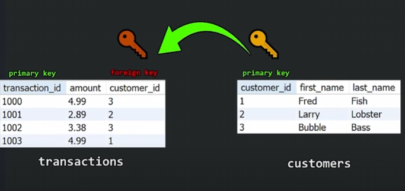

### Add foreign key constraint.

1. Let's create a customers table and populate it.
    ```sql
    CREATE TABLE customers(
        id INT PRIMARY KEY AUTO_INCREMENT,
        first_name VARCHAR(50),
        last_name VARCHAR(50)
    );

    INSERT INTO customers (first_name, last_name) VALUES
    ("Tony", "Stark"),
    ("Steve", "Rogers"),
    ("Natasha", "Romanoff");
    ```

2. Create a customers table and populate.
    ```sql
    CREATE TABLE transactions(
        transaction_id INT PRIMARY KEY AUTO_INCREMENT,
        amount DECIMAL(5, 2), -- (total no. of digits, total no. of digits after decimal e.g 123.45)
        customer_id INT,
        FOREIGN KEY(customer_id) REFERENCES customers(id)
    );

    -- Set starting AUTO_INCREMENT value to 1000
    ALTER TABLE transactions AUTO_INCREMENT = 1000;
    -- N.B. we can't do this directly while creating table idk why.

    -- Populate the table
    INSERT INTO transactions(amount, customer_id) VALUES
    (2.33, 2),
    (4.55, 1),
    (1.24, 3),
    (3.44, 1);
    ```

> Now a link has been created between customers and transactions. We can't delete a customer from customers table whose id is here in transaction table until we define certain properties. We will explore them in the upcoming part.

### Add a name to the foreign key:
```sql
ALTER TABLE transactions
ADD CONSTRAINT fk_customer_id
FOREIGN KEY(customer_id) REFERENCES customers(id);
```


<br>
<br>
<br>

# JOINS:

<br>

__Firstly let us add some more rows to the transaction table:__
```sql
INSERT INTO transactions(amount, customer_id) VALUES
    (6.24, NULL),
    (3.17, NULL);

SELECT * FROM transactions;
```
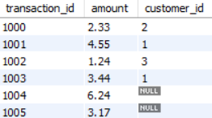

<br>

__Let's Add some more customers__
```sql
INSERT INTO customers (first_name, last_name) VALUES
    ("Bruce", "Banner"),
    ("Stephen", "Strange");

SELECT * FROM customers;
```


<br>

### Inner Join: 

> It shows us only the matching rows from both tables.

```sql
SELECT *
FROM transactions INNER JOIN customers
ON transactions.customer_id = customers.id;
```
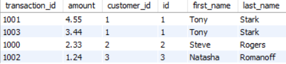

<br>
<br>

### Left Join:

> Whole left table and only matching rows from right table

```sql
SELECT *
FROM transactions LEFT JOIN customers
ON transactions.customer_id = customers.id;
```

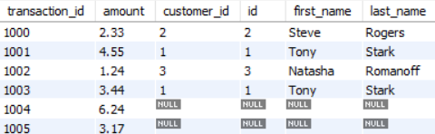


### Right Join.

> Whole right table and only matching rows from the left table.

```sql
SELECT *
FROM transactions RIGHT JOIN customers
ON transactions.customer_id = customers.id;
```

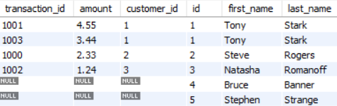


### Self Join
- Firstly lets add a new field to the customers table:
    ```sql
    ALTER TABLE customers
    ADD referral_id INT;
    ```

- Populate the column (customers within same table referred each other randomly)
    ```sql
    UPDATE customers
    SET referral_id = 1
    WHERE id = 2;

    UPDATE customers
    SET referral_id = 2
    WHERE id = 3;

    UPDATE customers
    SET referral_id = 2
    WHERE id = 4;

    UPDATE customers
    SET referral_id = 4
    WHERE id = 5;

    SELECT * FROM customers;
    ```
    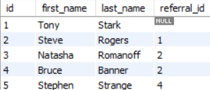

- Perform the self join
    ```sql
    SELECT * 
    FROM customers AS a
    INNER JOIN customers AS b
    ON a.referral_id = b.id;
    ```
    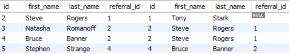

<br>
<br>
<br>


# Functions:

### `COUNT` - Number of rows in a column.

```sql
SELECT COUNT(amount)
FROM transactions;
```

### `MAX` - Maximum of any column.
```sql
SELECT MAX(amount) AS maximum --alias
FROM transactions;
```

### `MIN` - Finds minimum

### `AVG` - Finds average of any column
```sql
SELECT AVG(amount) AS average
FROM transactions;
```

### `SUM` - Finds the sum
```sql
SELECT SUM(amount) AS sum
FROM transactions;
```

### `CONCAT` - Concatenates two columns.
```sql
SELECT CONCAT(first_name, " ", last_name) AS full_name
FROM customers;
```

<br>
<br>
<br>

# Logical Operators

### Firstly lets add some more field to customers table:
```sql
ALTER TABLE customers
ADD COLUMN age INT,
ADD COLUMN is_member BOOLEAN DEFAULT FALSE;
```

> add age and is_member data

### `AND` Operator - Both conditions must be true
```sql
SELECT * FROM customers
WHERE age > 18 AND is_member = TRUE;
```

### `OR` Operator - Only one condition needs to be true
```sql
SELECT * FROM customers
WHERE age < 18 OR is_member = FALSE;
```

### `NOT` Operator 
```sql
SELECT * FROM customers
WHERE NOT is_member = TRUE;
```

### `BETWEEN` Operator
```sql
SELECT * FROM customers
WHERE age BETWEEN 18 AND 24;
```

### `IN` Operator
```sql
SELECT * FROM customers
WHERE first_name IN ("Steve", "Tony");
```

<br>
<br>
<br>


# Wild Cards

| Pattern                               | Description                                                                  |
|---------------------------------------|------------------------------------------------------------------------------|
| `WHERE first_name LIKE 'a%'`       | Finds any values that **start with** "a"                                     |
| `WHERE first_name LIKE '%a'`       | Finds any values that **end with** "a"                                       |
| `WHERE first_name LIKE '%or%'`     | Finds any values that **contain** "or" in **any position**                   |
| `WHERE first_name LIKE '_r%'`      | Finds any values that have "r" in the **second position**                    |
| `WHERE first_name LIKE 'a_%_%'`    | Finds any values that **start with "a"** and are **at least 3 characters**   |
| `WHERE last_name LIKE 'a%o'`       | Finds any values that **start with "a"** and **end with "o"**                |
| `WHERE last_name LIKE '__a%'`             | Finds any values where the **third character is "a"**                        |
| `WHERE last_name LIKE '___'`              | Finds any values that are **exactly 3 characters long**                      |
| `WHERE last_name LIKE '%\%%' ESCAPE '\'`  | Finds any values that **contain the actual percent symbol (%)**              |
| `WHERE last_name LIKE '%\_%' ESCAPE '\'`  | Finds any values that **contain the actual underscore symbol (_)***          |

<br>
<br>
<br>

# `ORDER BY` Clause.

> Shows the data of the table in ascending or descending order.
### Ascending order
```sql
SELECT * FROM customers
ORDER BY last_name;
```

### Descending order
```sql
SELECT * FROM customers
ORDER BY last_name DESC;
```


<br>
<br>
<br>


# `LIMIT` Clause.

> used for pagination

### Limit
```sql
SELECT * FROM customers
LIMIT 2;
```

### Offset
```sql
SELECT * FROM customers
LIMIT 20, 10; -- show next 10 customers after 20. offset = 20, limit = 10
```

<br>
<br>
<br>

# VIEWS
> it's not real data stored separately, but rather a saved SQL query that you can treat like a table.

1. Create view
    ```sql
    CREATE VIEW customer_name AS
    SELECT CONCAT(first_name, " ", last_name) AS full_name
    FROM customers;
    ```

2. View the created view
    ```sql
    SELECT * FROM customer_name;
    ```


<br>
<br>
<br>


# `INDEX`

- It's a BTree data structure
- Used to find values within a specific column more quickly
- MySQL normally searches sequentially through a column
- Larger the column , more expensive the operation is
- Using index minimizes `SELECT` time but `UPDATE` takes more time.

### Show indexes
```sql
SHOW INDEXES FROM customers;
```

> You will see customer_id is automatically indexed.

### Create index on a particular column.
```sql
CREATE INDEX last_name_idx
ON customers(last_name);
```

### Multi column index.
```sql
CREATE INDEX last_name_first_name_idx
ON customers(last_name, first_name);

-- It first searches on last name then first name
```

<br>
<br>
<br>

# Subqueries

```sql
SELECT * 
FROM transactions
WHERE amount > (
    SELECT AVG(amount) FROM transactions
);
```


<br>
<br>
<br>

# `GROUP BY` Clause
### Let's say we have this table:

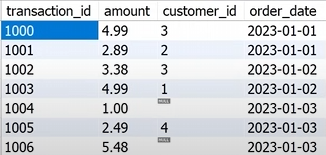

### Give group by command:
```sql
SELECT SUM(amount), order_date
FROM transactions
GROUP BY order_date;
```
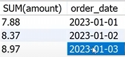

<br>
<br>

# `ROLLUP` Clause
- It's the extension of `GROUP BY` clause
- produces another row and shows the GRAND TOTAL (super-aggregate value)

### In the previous transaction table:

```sql
SELECT SUM(amount), order_date
FROM transactions
GROUP BY order_date WITH ROLLUP;
```

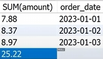

# `ON DELETE` clause

-- ON DELETE SET NULL = When a FK is deleted, replace FK with null
-- ON DELETE CASCADE = WHEN a FK is deleted, delete the entire row

```sql
CREATE TABLE transactions(
    transaction_id INT PRIMARY KEY AUTO_INCREMENT,
    amount DECIMAL(5, 2), -- (total no. of digits, total no. of digits after decimal e.g 123.45)
    customer_id INT,
    FOREIGN KEY(customer_id) REFERENCES customers(id)
    ON DELETE CASCADE
    );
```


<br>
<br>
<br>


# Stored Procedures
Its a prepared SQL code that you can save and run again later.

### Create Procedure:
```sql
DELIMITER $$
CREATE PROCEDURE get_customers()
BEGIN
    SELECT * FROM customers;
END $$
DELIMITER ;
```
> `DELEMITER` can set character/'s that defines the end of a query. We are setting the DELIMITER to be $$ because if it was ; then the query would stop at customers; and we won't be able to create the procedure.

### Delete Procedure:
```sql
DROP PROCEDURE get_customers;
```

### Procedure with parameters:
- create
    ```sql
    DELIMITER $$
    CREATE PROCEDURE find_customer(IN customer_id INT)
    BEGIN
        SELECT *
        FROM customers
        WHERE id = customer_id;
    END $$
    DELIMITER ;
    ```

- call
    ```sql
    CALL find_customer(2);
    ```

<br>
<br>
<br>

# TRIGGERS

When an event happens, do something. ex. (INSERT, UPDATE, DELETE). checks data, handles errors, auditing tables

### Let's say we have this table employees:

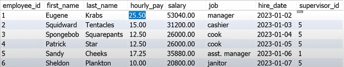

#### On every change of the hourly_pay we will update the salary by trigger.

```sql
CREATE TRIGGER before_hourly_pay_update
BEFORE UPDATE ON employees
FOR EACH ROW
SET NEW.salary = (NEW.hourly_pay * 2080);
```

### Show triggers
```sql
SHOW TRIGGERS;
```